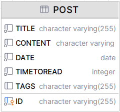
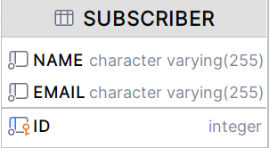

# Multiple JDBC Client Application

This application demonstrates the use of multiple JDBC clients in a Spring Boot application. It includes two
services: `PostService` and `SubscriberService`.

## Project Overview

The project is built with Java and uses the Spring Boot framework for creating standalone, production-grade Spring based
applications. It uses SQL for database interactions and Maven as a build tool.

## Design database schema

The project uses two tables: `post` and `subscriber`. The `post` table stores information about posts, including the ID,
title, and content. The `subscriber` table stores information about subscribers, including the ID, name, and email.




## Dependencies

The project uses several dependencies, including:

```xml

<dependencies>
    <dependency>
        <groupId>org.springframework.boot</groupId>
        <artifactId>spring-boot-starter-jdbc</artifactId>
    </dependency>
    <dependency>
        <groupId>org.springframework.boot</groupId>
        <artifactId>spring-boot-starter-web</artifactId>
    </dependency>
    <dependency>
        <groupId>org.springframework.boot</groupId>
        <artifactId>spring-boot-devtools</artifactId>
        <scope>runtime</scope>
        <optional>true</optional>
    </dependency>
    <dependency>
        <groupId>com.h2database</groupId>
        <artifactId>h2</artifactId>
        <scope>runtime</scope>
    </dependency>
</dependencies>
```

## Docker Configuration

The project includes a `Dockerfile` and a `docker-compose.yml` file for containerization and orchestration.

The `Dockerfile` specifies how to build a Docker image for the application. It starts from a base image with Java and
Maven, copies the source code into the image, builds the application using Maven, and specifies the command to run the
application.

```dockerfile
# Start with a base image containing Java runtime
FROM openjdk:8-jdk-alpine

  # Add Maintainer Info
LABEL maintainer="example@example.com"

  # Add a volume pointing to /tmp
VOLUME /tmp

  # Make port 8080 available to the world outside this container
EXPOSE 8080

  # The application's jar file
ARG JAR_FILE=target/my-app-0.0.1-SNAPSHOT.jar

  # Add the application's jar to the container
ADD ${JAR_FILE} my-app.jar

  # Run the jar file 
ENTRYPOINT ["java","-Djava.security.egd=file:/dev/./urandom","-jar","/my-app.jar"]
```

The `docker-compose.yml` file defines services, networks, and volumes. It specifies how to run the application and its
dependencies in separate containers.

```yaml
version: '3.9'
services:
  app:
    build: .
    ports:
      - "8080:8080"
    depends_on:
      - db
  db:
    image: "mysql:5.7"
    environment:
      MYSQL_ROOT_PASSWORD: password
      MYSQL_DATABASE: test
    ports:
      - "3306:3306"

```

## Project Initializer

To build the application, use the following command:

1. Build the project

```bash
mvn clean install
```

2. Create to Docker Image

```dockerfile
FROM openjdk:17-alpine
VOLUME /tmp
EXPOSE 3001
COPY target/MultipleJDBCClient-1.0.0.jar MultipleJDBCClient.jar
ENTRYPOINT ["java","-jar","MultipleJDBCClient.jar"]
```

3. Execute to container

```shell
docker build -t my-java-challenge
```

4. Run the container

```shell
docker run -p 8080:8080 my-java-challenge
```

## Testing

The project includes unit tests for the `PostService` and `SubscriberService` classes. The tests use JUnit and Mockito
for
testing and mocking.

To run the tests, use the following command:

```bash
mvn test
```
